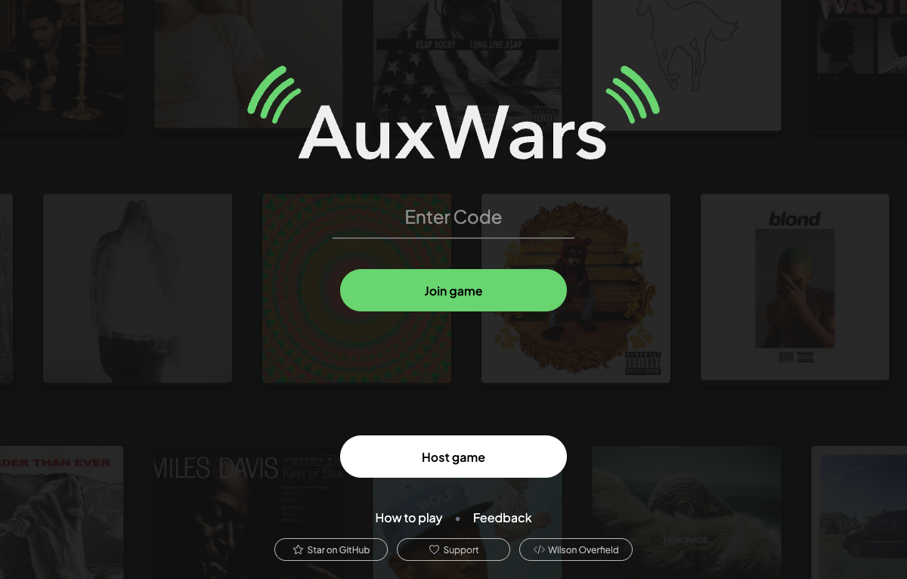
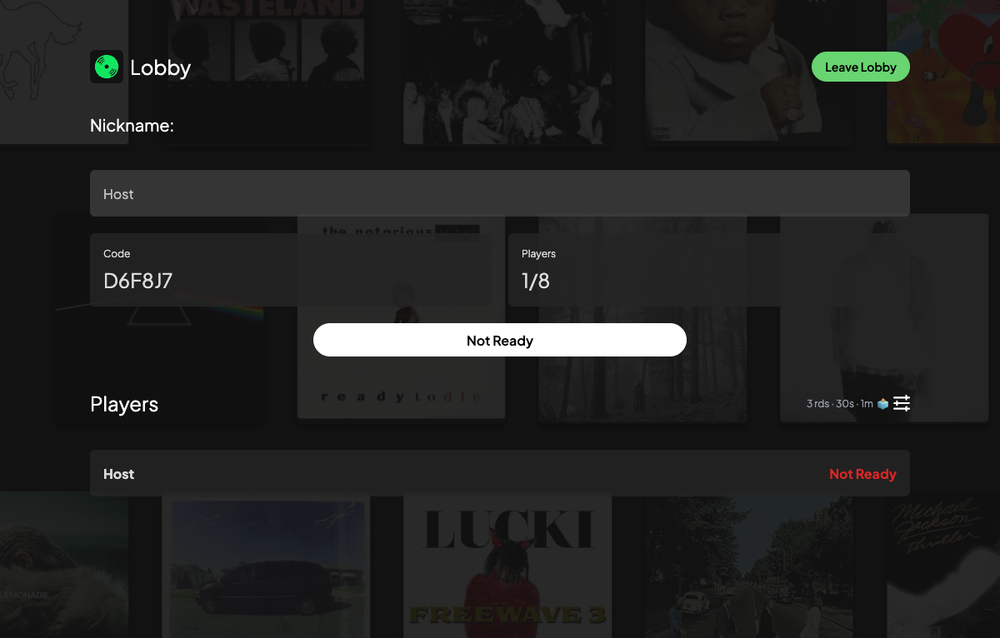
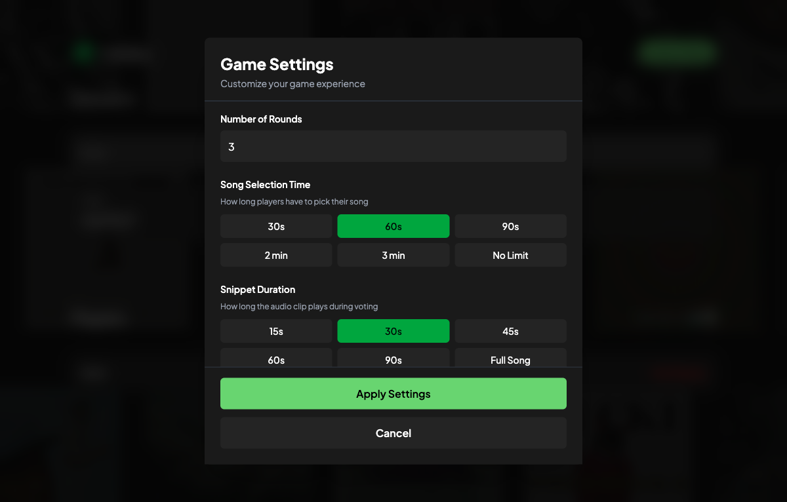
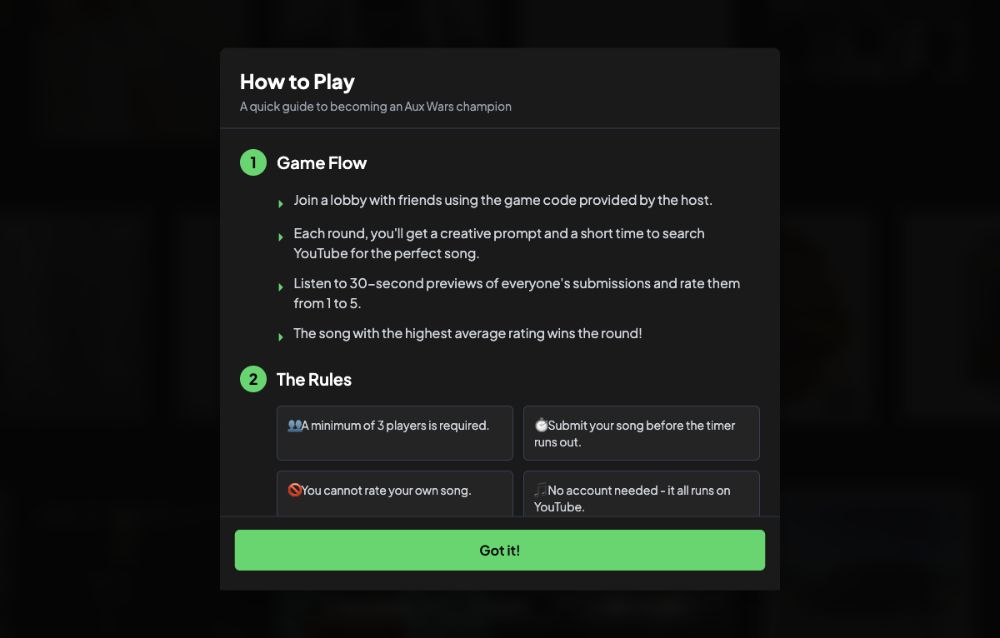

# aux wars

settle music taste arguments with your friends

**[play now at aux-wars.com](https://aux-wars.com)**

## how it works

1. **host a game** - create a room and share the code with friends
2. **get a prompt** - something like "song that makes you wanna text your ex"
3. **pick a song** - search for the perfect track and preview it
4. **rate each other** - listen to everyone's picks and vote 1-5
5. **crown the winner** - best average rating wins the round

## screenshots

### lobby

### game settings

### how to play

<!-- TODO: add gameplay screenshots
### song selection

### rating

### results

-->

## features

- works on phones
- no signups or logins
- 30-second song previews from iTunes & Deezer
- real-time multiplayer
- custom prompts + themed prompt packs
- configurable round timers

## stats

**1,000+ games played** with 50,000+ song ratings

## tech

react, convex, itunes + deezer apis, tailwind

---

built by [wilson overfield](https://github.com/woverfield)
